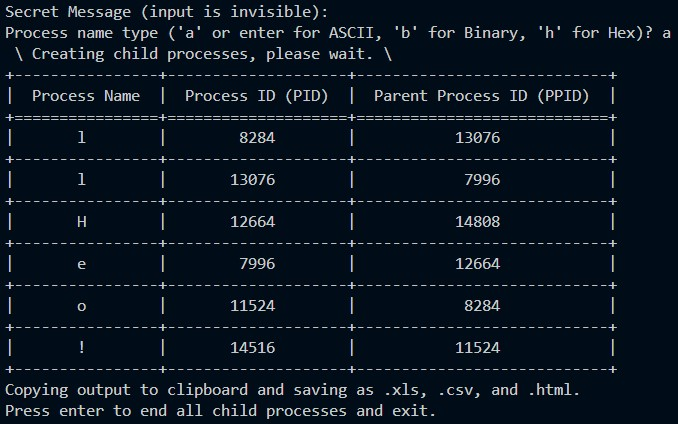

# processage v0.2

Processage embeds a secret message into a process tree (real/running) and displays the processes in a shuffled table. Re-construct the process family tree to decode the secret message.  Update 10/5/24: Created with Python 3.8, compatible with 3.12.

## Description

Understanding PIDs and PPIDS was challenging for my students, so I made processage to help with that (and for fun and to help me learn new things, too). The goal was to sort of gamify learning about PIDs and PPIDs.

* Each character in the secret message spawns a new process, which process is parented to the previous character's process.
    * Process names may be set to the ASCII plaintext, binary, or hex representation of each character in the secret message.
* Linux
    * Sets process names on Linux.  While active, try: 
        ```
        ps -e | less
        ps -el | less
        ps -eo %c%p%P | less
        ps -ef # important note: f flag will not show new process names
        ```
    * To reveal ordered tree with names, try:  
        ```
        pstree -ap | grep processage
        ```
* Windows
    * Process names are available in processage and Windows Process Explorer, but not in Task Manager or via wmic.  For more info:
        * See [setproctitle](https://pypi.org/project/setproctitle/)
        * See [Windows Process Explorer](http://technet.microsoft.com/en-us/sysinternals/bb896653.aspx)
* At close, processage copies the shuffled process tree (game board?) to the clipboard and saves it as csv, html, and markdown.
    * Example output is shown in output.csv, output.md, and output.html.
    * Comment out lines 99-112 to disable saving output.
    * These files could be useful for creating secret message worksheets.
* For fun, try using a shortened url as the secret message.
* Basically, a linked list.

## Getting Started

### Cloning and Environment Setup
* Linux:
```
git clone https://github.com/FrozenBurrito/processage.git
cd processage
python -m venv .
source bin/activate
pip install -r requirements.txt
```
* Windows
```
git clone https://github.com/FrozenBurrito/processage.git
cd processage
python -m venv .
scripts\activate.bat 
pip install -r requirements.txt
```

### Running processage
```
python processage.py
```

## Help

Let me know if you have any questions or suggestions.

## Authors

J Mo, [frozenburrito](https://github.com/frozenburrito)

## Version History
* 0.2
    * Added process name options (ASCII plaintext, binary, or hex)
* 0.1
    * It works!

## License

This project is licensed under the MIT License.  See the LICENSE.md file for details.

## Helpful Libraries

* [setproctitle](https://pypi.org/project/setproctitle/)
